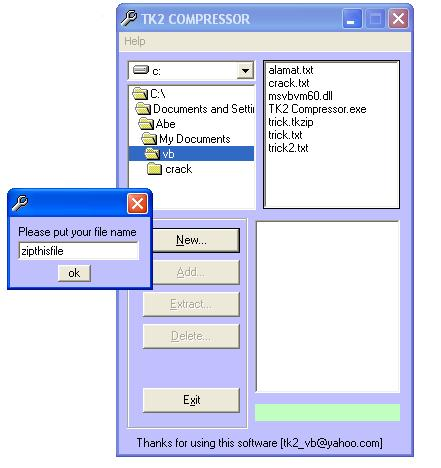



## Tk2 compressor

### Description

the code that compress a file.

my first upload was failed...so i tried another one..please vote
 
### More Info
 
just no how to use API

-n0-

             |
---                |---
**Submitted On**   |2003-11-21 23:01:22
**By**             |[Syukran](https://github.com/Planet-Source-Code/PSCIndex/blob/master/ByAuthor/syukran.md)
**Level**          |Beginner
**User Rating**    |5.0 (10 globes from 2 users)
**Compatibility**  |VB 6\.0
**Category**       |[Complete Applications](https://github.com/Planet-Source-Code/PSCIndex/blob/master/ByCategory/complete-applications__1-27.md)
**World**          |[Visual Basic](https://github.com/Planet-Source-Code/PSCIndex/blob/master/ByWorld/visual-basic.md)
**Archive File**   |[Tk2\_compre16782211302003\.zip](https://github.com/Planet-Source-Code/syukran-tk2-compressor__1-50215/archive/master.zip)

